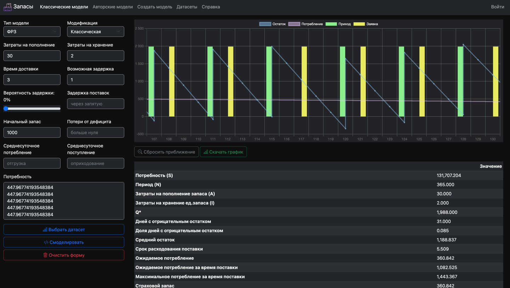
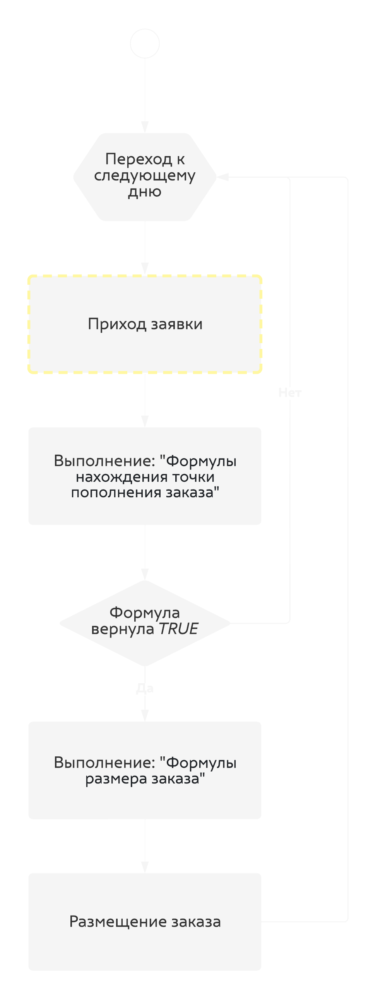

# Моделирование движения запасов

Сервис для моделирования движения запасов.
Поддерживает возможность использования как классических, так и авторских моделей.


Пример интерфейса:


### Запуск

Клонировать репозиторий:

```bash
git clone https://github.com/kovalenkong/stock_modeling.git
```

Установить зависимости:

```bash
python3 -m venv venv
source venv/bin/activate
pip install -r requirements.txt
```

Подготовка .env файла:
```dotenv
DEBUG=true/false
ALLOWED_HOSTS=host1,host2,hostN
```

Миграции и создание суперюзера:

```bash
python manage.py migrate
python manage.py createsuperuser
```

Запуск проекта:

```bash
python manage.py runserver
```

После этого проект доступен локально по ссылке http://localhost:8000


### Справка

Данный сервис позволяет описать любую модель управления запасами двумя формулами.


Главная идея данного сервиса состоит в том, что любую модель управления запасами можно описать двумя формулами:
*формулой нахождения точки размещения заказа* и *формулой размера заказа*.
Сервис предоставляет предопределенные формулы, константы и переменные с помощью которых можно описывать 
разные модели управления запасами.

Схематично процесс выполнения авторской модели можно представить в виде следующего процесса:

<div class='text-center'>
    
</div>
Оценивающая функция (опциональная) позволит 


##### Описание формул

- _Формула нахождения точки размещения заказа_: формула, которая определяет, _нужно ли_ делать заказ.
Данная формула должна вернуть значение TRUE либо FALSE. Соответственно, если формула возвращает TRUE - 
заказ будет размещен в день вычисления формулы.
- _Формула размера заказа_: формула, которая определяет размер заказа (заказ будет размещен в день, 
когда формула нахождения точки размещения заказа вернула TRUE).
Формула должна вернуть число (кроме того, формула может быть константой - в этом случае каждый раз будет размещаться 
один и тот же размер заказа)
- _Оценивающая функция_ (опционально): функция, которая должна вернуть число. Данная функция используется 
для оценки качества модели:
например, формула может суммировать общие затраты (если главной задачей является снижение общих затрат).


##### Типы данных

- `Number` - число
- `String` - строка
- `Array` - массив элементов


##### Константы
- `S` (<small>Number</small>) - сумма потребления за весь период
- `A` (<small>Number</small>) - затраты на пополнение
- `I` (<small>Number</small>) - затраты на хранение
- `Delivery` (<small>Number</small>) - время доставки в днях
- `Delay` (<small>Number</small>) - время возможной задержки в днях
- `Consumption` (<small>Array</small>) - потребление, список чисел длиною в период


##### Переменные
- `day` (<small>Number</small>) - индекс текущего дня (начиная с нуля)
- `balance` (<small>Number</small>) - баланс текущего дня
- `out` (<small>Number</small>) - количество отправленных, но не привезенных заявок (заявок в пути)


##### Результирующие значения
<small>Результирующие значения - значения, доступные после построения модели. Доступны только в оценивающей функции.</small>

- `Fact` (<small>Array</small>) - фактический баланс
- `Income` (<small>Array</small>) - пришедшие заявки (массив чисел из нулей и положительных чисел длиною в период, 
где каждое число - размер прихода, >=0)
- `Outcome` (<small>Array</small>) - отправленные заявки (массив чисел из нулей и положительных чисел длиною в период, 
где каждое число - размер заявки, >=0)


##### Формулы
- `SUM(<Array>)` - суммирует диапазон
- `MEAN(<Array>)` - находит среднее значение
- `STD(<Array>)` - находит стандартное отклонение величины
- `COUNT(<Array>)` - возвращает длину последовательности
- `MAX(<Array>)` - максимальное число из последовательности
- `MIN(<Array>)` - минимальное число из последовательности
- `ABS(<Number>)` - возвращает модуль числа
- `SQRT(<Number>)` - возвращает корень числа
- `ROUND(<Number>)` - округляет число до целого
- `SUMIFS(<Array>, <String>, [<String> ...])` - суммирует диапазон по заданным условиям, 
например: _SUMIFS(Fact, ">0", "<100")_. Функция возвращает число
- `COUNTIFS(<Array>, <String>, [<String> ...])` - подсчитывает количество элементов в массиве по заданным условиям.
Функция возвращает число
- `FILTER(<Array>, <String>, [<String> ...])` - фильтрует массив элементов по заданным условиям. Функция возвращает массив
- `AND(<Bool>, [<Bool> ...])` - возвращает истину, если все элементы в формуле возвращают истину
- `OR(<Bool>, [<Bool> ...])` - возвращает истину, если хотя бы один элемент возвращает истину
- `MOD(<Number>, <Number>)` - возвращает остаток от деления первого числа на второе
- `SLICE(<Array>, <Number>, <Number>)` - возвращает срез массива (вторым аргументом индекс "от", третьим - индекс "до")


##### Математические операции
- `+` - сложение
- `-` - вычитание
- `*` - умножение
- `/` - деление
- `^` - возведение в степень


##### Логические операции (возвращают TRUE либо FALSE)
- `>` - значение слева больше значения справа
- `<` - значение слева меньше значения справа
- `>=` - значение слева больше или равно значения справа
- `<=` - значение слева меньше или равно значения справа
- `=` - значение слева равно значению справа


**Матрица доступности формул и операторов в формулах**
<div class='table-responsive-lg'>
    <table class="table table-bordered text-light">
      <thead>
      <tr>
        <th></th>
        <td>Формула нахождения точки пополнения заказа</td>
        <td>Формула размера заказа</td>
        <td>Оценивающая функция</td>
      </tr>
      </thead>
      <tbody>
      <tr>
        <th>Константы</th>
        <td>&#9989;</td>
        <td>&#9989;</td>
        <td>&#9989;</td>
      </tr>
      <tr>
        <th>Переменные</th>
        <td>&#9989;</td>
        <td>&#9989;</td>
        <td>&#10060;</td>
      </tr>
      <tr>
        <th>Формулы</th>
        <td>&#9989;</td>
        <td>&#9989;</td>
        <td>&#9989;</td>
      </tr>
      <tr>
        <th>Математические операции</th>
        <td>&#9989;</td>
        <td>&#9989;</td>
        <td>&#9989;</td>
      </tr>
      <tr>
        <th>Логические операции</th>
        <td>&#9989;</td>
        <td>&#9989;</td>
        <td>&#9989;</td>
      </tr>
      <tr>
        <th>Результирующие значения</th>
        <td>&#10060;</td>
        <td>&#10060;</td>
        <td>&#9989;</td>
      </tr>
      </tbody>
    </table>
</div>

___

#### Примеры
##### Пример 1 - ФРЗ:

В соответствии со стилем и синтаксиса данного сервисом, можно переписать, например, метод ФРЗ.

В модели ФРЗ моментом заявки будет служить тот день, когда:
- Уровень запаса опускается ниже порогового уровня
- Предыдущая заявка была привезена

Пороговый уровень определяется как:

```logic
Страховой запас + Ожидаемое потребление за время поставки =
= (Ожидаемое потребление * Возможная задержка поставки) + (Время выполнения заказа * Ожидаемое потребление) =
= ((Потребность / Количество дней) * Возможная задержка поставки) + (Время выполнения заказа * (Потребность / Количество дней)) =
= (S/COUNT(Consumption))*Delay + Delivery*(S/COUNT(Consumption))
```

Соответственно, _Уровень запаса опускается ниже порогового уровня_ можно записать как:
```login
balance <= S/COUNT(Consumption))*Delay + Delivery*(S/COUNT(Consumption)
```

На языке сервиса _Предыдущая заявка была привезена_ будет означать, что количество _Отправленных, но не выполненных 
заявок_ (`out`) равно нулю, т.е.: `out = 0`

Итого, _Формула нахождения точки пополнения товара будет иметь вид:
```logic
AND(balance <= S/COUNT(Consumption))*Delay + Delivery*(S/COUNT(Consumption); out = 0)
```

Формула размера заказа: Q* (фиксированное значение)
Рассчитывается как:

```logic
SQRT((2 * A * S)/I)
```

##### Пример 2 - ФИВ

В модели ФИВ временной промежуток между размещением заказа является постоянным.
Данный интервал вычисляется по формуле `(N*Q)/S`:

```logic
(N * Q) / S =
= (N * SQRT((2 * A * S)/I)) / S =
= (COUNT(Consumption) * SQRT((2 * A * S)/I)) / S
```

Соответственно, _Формула нахождения точки пополнения заказа_ будет иметь вид:

```logic
AND((COUNT(Consumption) * SQRT((2 * A * S)/I)) / S; out = 0)
```

где `out = 0` означает, что новый заказ будет размещен только после того, как будет выполнен предыдущий

Размер заказа варьируется в зависимости от остатка и рассчитывается по формуле:

```logic
Максимальный запас - Наличный запас + Ожидаемое потребление = 
= (Страховой запас + Оптимальный интервал времени между заказами * Ожидаемое потребление) - Наличный запас + (1 / Количество дней) =
= ((Ожидаемое потребление * Возможная задержка) + Оптимальный интервал времени между заказами * (Потребность / Количество дней)) - Наличный запас + (Потребность / Количество дней) =
= (((Потребность / Количество дней) * Возможная задержка) + Оптимальный интервал времени между заказами * (Потребность / Количество дней)) - Наличный запас + (Потребность / Количество дней)
```

Соответственно, _Формула размера заказа_ будет иметь вид:

```logic
((MEAN(Consumption) * Delay) + ((COUNT(Consumption) * SQRT((2 * A * S)/I)) / S) * MEAN(Consumption)) - balance + MEAN(Consumption)
```

#### Пример оценивающей функции

Каждая из моделей управления запасами оптимизирует один или несколько параметров. _Что_ оптимизировать
может зависеть от разных факторов.

Рассмотрим пример оценивающей функции, которая будет отвечать на вопрос: "Какова доля дней с отрицательным остатком?"
Декомпозируя вопрос, нужно: подсчитать количество дней, где остаток был отрицательным, и разделить полученное число на
количество дней в периоде. Соответственно, оценивающая функция будет иметь вид:

```logic
COUNTIFS(Fact; "<0") / COUNT(Fact)
```

Рассмотрим другой пример, где компании требуется минимизировать затраты на заказ. В данном примере оценивающая функция
может возвращать общую сумму затрат на пополнение:

```logic
COUNTIFS(Outcome; ">0") * A
```

Рассмотрим пример, где компании требуется минимизировать затраты на хранение. Тогда оценивающая функция может иметь
следующий вид:

```logic
SUM(FILTER(Fact; ">0") * I)
```

где `FILTER(Fact; ">0")` - массив фактических неотрицательных остатков

